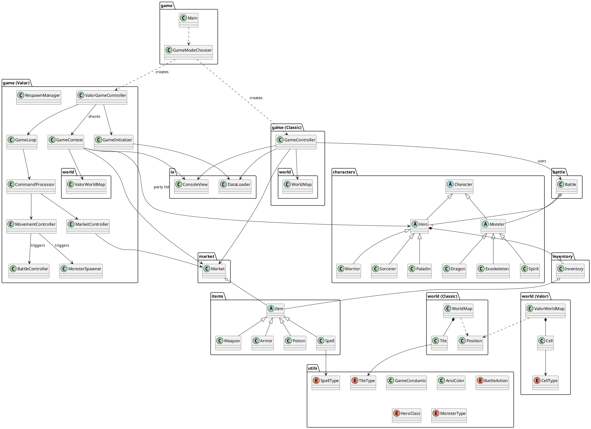

# Project Class Structure & Hierarchy

This project implements two RPG games: **Monsters & Heroes** and **Legends of Valor**. They share a common core of characters, items, and utilities, but diverge in their game control logic and world representation.

## 1. Entry Point
*   **`src/game/Main.java`**: The application entry point.
*   **`src/game/GameModeChooser.java`**: Presents a menu to select the game mode:
    1.  **Monsters & Heroes** -> Instantiates `GameController`
    2.  **Legends of Valor** -> Instantiates `ValorGameController`

## 2. Shared Core Components
These classes are used by both game modes.

### Characters (`src/characters/`)
*   **`Character`** (Abstract Base)
    *   **`Hero`** (Abstract)
        *   `Warrior`
        *   `Sorcerer`
        *   `Paladin`
    *   **`Monster`** (Abstract)
        *   `Dragon`
        *   `Exoskeleton`
        *   `Spirit`

### Items (`src/items/`)
*   **`Item`** (Abstract Base)
    *   `Weapon`
    *   `Armor`
    *   `Potion`
    *   `Spell` (IceSpell, FireSpell, LightningSpell logic handled via `SpellType`)

### Battle Logic (`src/battle/`)
*   **`Battle`**: Represents a battle instance. Handles turn logic, attack calculations, and state updates. Used by both games as the underlying model for combat.

### IO & Utils (`src/io/`, `src/utils/`)
*   **`ConsoleView`**: Handles all console input/output.
*   **`DataLoader`**: Parses configuration files (Heroes, Monsters, Items).
*   **`GameConstants`**, **`AnsiColor`**, **`BattleAction`**, etc.

---

## 3. Monsters & Heroes (Classic Mode)
This mode uses a monolithic controller design and a simpler tile-based map.

### Controller (`src/game/`)
*   **`GameController`**: A monolithic class that manages the entire lifecycle of the classic game. It handles:
    *   Initialization
    *   Game Loop
    *   Movement
    *   Market interactions
    *   Battle UI and flow (using `Battle` model)

### World (`src/world/`)
*   **`WorldMap`**: Represents the game world as a grid of `Tile` objects.
*   **`Tile`**: A simple tile that can be `COMMON`, `MARKET`, or `INACCESSIBLE`.
*   **`Position`**: Represents (row, col) coordinates.

---

## 4. Legends of Valor (New Mode)
This mode uses a modular, component-based design to handle increased complexity (lanes, nexus, respawning, etc.).

### Controller & Components (`src/game/`)
*   **`ValorGameController`**: The main orchestrator. It initializes the components and starts the loop.
*   **`GameContext`**: A shared state object passed between controllers. Holds the `WorldMap`, `Party`, `Markets`, etc.
*   **`GameInitializer`**: Handles setup (loading data, creating map, spawning initial entities).
*   **`GameLoop`**: Manages the main turn-based loop.
*   **`CommandProcessor`**: Parses user input and delegates to specific controllers.
*   **`MovementController`**: Handles hero movement, teleportation, recall, and triggers battles.
*   **`BattleController`**: Manages the battle execution flow (UI and interaction with `Battle` model).
*   **`MarketController`**: Handles buying/selling logic.
*   **`MonsterSpawner`**: Logic for spawning new waves of monsters.
*   **`RespawnManager`**: Handles hero respawning mechanics.

### World (`src/world/`)
*   **`ValorWorldMap`**: A specialized map representing the 3-lane board.
*   **`Cell`**: Represents a cell on the board. Unlike `Tile`, a `Cell` can hold both a `Hero` and a `Monster` simultaneously.
    *   Types: `NEXUS`, `PLAIN`, `BUSH`, `CAVE`, `KOUT`, `INACCESSIBLE`.

---

## 5. File Hierarchy

```text
src/
├── battle/
│   └── Battle.java
├── characters/
│   ├── Character.java
│   ├── Dragon.java
│   ├── Exoskeleton.java
│   ├── Hero.java
│   ├── Monster.java
│   ├── Paladin.java
│   ├── Sorcerer.java
│   ├── Spirit.java
│   └── Warrior.java
├── game/
│   ├── BattleController.java
│   ├── CommandProcessor.java
│   ├── GameContext.java
│   ├── GameController.java
│   ├── GameInitializer.java
│   ├── GameLoop.java
│   ├── GameModeChooser.java
│   ├── Main.java
│   ├── MarketController.java
│   ├── MonsterController.java
│   ├── MonsterSpawner.java
│   ├── MovementController.java
│   ├── RespawnManager.java
│   └── ValorGameController.java
├── inventory/
│   └── Inventory.java
├── io/
│   ├── ConsoleView.java
│   └── DataLoader.java
├── items/
│   ├── Armor.java
│   ├── Item.java
│   ├── Potion.java
│   ├── Spell.java
│   └── Weapon.java
├── market/
│   └── Market.java
├── utils/
│   ├── AnsiColor.java
│   ├── BattleAction.java
│   ├── GameConstants.java
│   ├── HeroClass.java
│   ├── MonsterType.java
│   ├── SpellType.java
│   └── TileType.java
└── world/
    ├── Cell.java
    ├── CellType.java
    ├── Position.java
    ├── Tile.java
    ├── ValorWorldMap.java
    └── WorldMap.java
```

## 6. Class Relationships (PlantUML)


